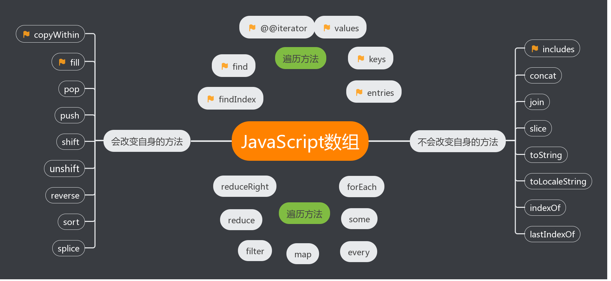

# Array


::: tip 概述
  数组是一种非常重要的数据类型，它语法简单、灵活、高效。 在多数编程语言中，数组都充当着至关重要的角色，以至于很难想象没有数组的编程语言会是什么模样。特别是JavaScript，它天生的灵活性，又进一步发挥了数组的特长，丰富了数组的使用场景。可以毫不夸张地说，不深入地了解数组，不足以写JavaScript。
  
  截止ES7规范，数组共包含33个标准的API方法和一个非标准的API方法，使用场景和使用方案纷繁复杂，其中有不少浅坑、深坑、甚至神坑。下面将从Array构造器及ES6新特性开始，逐步帮助你掌握数组。
  
  声明：以下未特别标明的方法均为ES5已实现的方法。
:::
---
::: tip 数组定义
   * 数组是值的集合。
   * JavaScript数组是无类型的
   * JavaScript数组是动态的
   * JavaScript数组可能是稀疏的
   * JavaScript数组是对象的特殊形式，一般来讲用数字索引发访问元素比对象属性要快
   * 数组继承自Array.prototype中的属性
:::
## Array构造器
Array构造器用于创建一个新的数组。通常，我们推荐使用对象字面量创建数组，这是一个好习惯，但是总有对象字面量乏力的时候，比如说，我想创建一个长度为8的空数组。请比较如下两种方式：

``` js
// 使用Array构造器
var a = Array(8); // [undefined × 8]
// 使用对象字面量
var b = [];
b.length = 8; // [undefined × 8]
```
Array构造器明显要简洁一些，当然你也许会说，对象字面量也不错啊，那么我保持沉默。
如上，我使用了Array(8)而不是new Array(8)，这会有影响吗？实际上，并没有影响，这得益于Array构造器内部对this指针的判断，ELS5_HTML规范是这么说的：
>When Array is called as a function rather than as a constructor, it creates and initialises a new Array object. Thus the function call Array(…) is equivalent to the object creation expression new Array(…) with the same arguments.

从规范来看，浏览器内部大致做了如下类似的实现：
``` js
function Array(){
  // 如果this不是Array的实例，那就重新new一个实例
  if(!(this instanceof arguments.callee)){
    return new arguments.callee();
  }
}
```
Array构造器根据参数长度的不同，有如下两种不同的处理：

new Array(arg1, arg2,…)，参数长度为0或长度大于等于2时，传入的参数将按照顺序依次成为新数组的第0至N项（参数长度为0时，返回空数组）。
new Array(len)，当len不是数值时，处理同上，返回一个只包含len元素一项的数组；当len为数值时，根据如下规范，len最大不能超过32位无符号整型，即需要小于2的32次方（len最大为Math.pow(2,32) -1或-1>>>0），否则将抛出RangeError。
