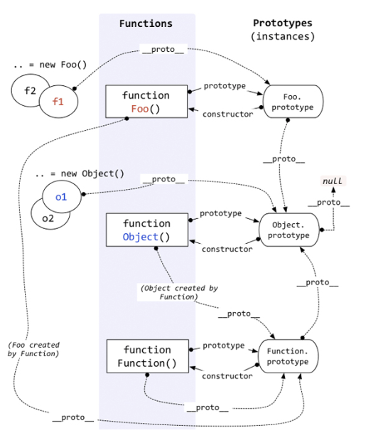

# Array.isArray
顾名思义，Array.isArray用来判断一个变量是否数组类型,我们至少有如下5种方式去判断一个值是否数组
``` js
var a = [];
// 1.基于instanceof
a instanceof Array;
// 2.基于constructor
a.constructor === Array;
// 3.基于Object.prototype.isPrototypeOf
Array.prototype.isPrototypeOf(a);
// 4.基于getPrototypeOf
Object.getPrototypeOf(a) === Array.prototype;
// 5.基于Object.prototype.toString
Object.prototype.toString.apply(a) === '[object Array]';
```
既然说到这里就简单分析一下常用的数据类型判断                             
## instanceof
::: tip instanceof 判断类型
  instanceof运算符用于测试构造函数的prototype属性是否出现在对象的原型链中的任何位置</br>
  instanceof 运算时会递归查找L的原型链，即 L.__proto__.__proto__.__proto__.__proto__... 
  直到找到了或者找到顶层为止。</br>
  L instanceof R //instanceof运算时，通过判断L的原型链上是否存在R.prototype</br>
  L.__proto__.__proto__ ..... === R.prototype ？ //如果存在返回true 否则返回false
:::
通常解释:在JS中，用typeof来判断基本类型，instanceof判断引用类型
``` js
console.log('aa' instanceof String) // 都说了判断引用类型，拿个基本类型出来坑爹么
let obj_string = new String('aa');
console.log(obj_string instanceof String)
```
``` js
// 大家伙们都属于object(所有对象都是Object实例)
console.log({} instanceof Object)  //true
console.log([] instanceof Array) //true
console.log([] instanceof Object) //true
console.log(function() {} instanceof Function) //true
console.log(function() {} instanceof Object) //true
```
``` js
//检测某个对象是不是另一个对象的实例
function Foo(){}
function BFoo(){}
Foo.prototype = new BFoo();//JavaScript 原型继承
let foo = new Foo();
console.log(foo instanceof Foo); //true
console.log(foo instanceof BFoo) //true
```
其实上面三个例子都比较基础，相信都难不倒大家，再看几个复杂点的
``` js
console.log(String instanceof String); //false
console.log(Object instanceof Object); //true
console.log(Function instanceof Function); //true
console.log(Function instanceof Object); //true

function Foo(){} 
function BFoo(){} 
Foo.prototype = new BFoo(); 
console.log(Foo instanceof Function);  //true
console.log(Foo instanceof Foo); //false
```
>MDN的定义</br>
object instanceof constructor</br>
instanceof 运算符用来测试一个对象在其原型链中是否存在一个构造函数的 prototype 属性。

先看MDN里面的解释，左边是要测试的对象，右边是构造函数
是否能在对象的原型链上（顺着__proto__一直往上找）找到构造函数的原型属性（[constructor].prototype）

直接看实现代码吧

``` js
function instance_of(L, R) {//L 表示左边的object，R 表示右边的constructor
 const R_P = R.prototype;// 取 R 的显式原型
 L = L.__proto__;// 取 L 的隐式原型,并且可能会顺着原型链重新赋值
 while (true) { 
   if (L === null) 
     return false; 
   if (R_P === L)// 这里重点：严格比较 true 
     return true; 
   L = L.__proto__; 
 } 
}
```
再祭出我们的原型链大杀器



划个重点
* __proto__ 属性，指向了创建该对象的构造函数的原型
* 所有JS 对象都有 __proto__ 属性，除了Object.prototype.__proto__ === null
* 注意Object(),它是由function生成的，所以它的__proto__属性指向了function的构造器Function的原型Function.prototype
* 注意构造器Function,它是唯一一个prototype和__proto__指向相同的对象
* 一般来说，我们日常自行创建的构造器Foo的__proto__属性指向function的构造器Function的原型Function.prototype，但是构造器的原型对象Foo.prototype的__proto__属性是直接指向Object.prototype对象的

直接找一个例子来讲解，相信聪明的你们一定能够融会贯通，举一反三
``` js
console.log(Object instanceof Object); // true
```
再看instanceof的实现代码
``` js
function instance_of(L, R) {//L 表示左边的object，R 表示右边的constructor
 const R_P = R.prototype;// 取 R 的显式原型
 L = L.__proto__;// 取 L 的隐式原型,并且可能会顺着原型链重新赋值
 while (true) { 
   if (L === null) 
     return false; 
   if (R_P === L)// 这里重点：严格比较 true 
     return true; 
   L = L.__proto__; 
 } 
}
```
首先，左右表达式赋值
``` js
L = Object
R = Object
R_P = Object.prototype = Object.prototype
L = Object.__proto__ = Function.prototype
```
2、第一次判断
``` js
L !== null => R_P !== L
判断不为true
继续寻找L的原型链，准备下一轮赋值
```
3、第二轮赋值
``` js
L = Function.prototype.__proto__  =  Object.prototype
```
4、第二次判断
``` js
return true
```
再简单说一个
``` js
console.log(String instanceof String) //false
```
判断过程是
``` js
//L = String => String.__proto__ = Function.prototype  =>Function.prototype.__proto__ =>Object.prototype
//R = String => String.prototype 
:RESULT
L != R
```
## typeof
typeof 一般被用于判断一个变量的类型，我们可以利用 typeof 来判断number,  string,  object,  boolean,  function, undefined,  symbol 这七种类型，这种判断能帮助我们搞定一些问题，比如在判断不是 object 类型的数据的时候，typeof能比较清楚的告诉我们具体是哪一类的类型。但是，很遗憾的一点是，typeof 在判断一个 object的数据的时候只能告诉我们这个数据是 object, 而不能细致的具体到是哪一种 object, 但是Object 下还有很多细分的类型呐，如 Array、Function、Date、RegExp、Error 等

如果用 typeof 去检测这些类型，举个例子：
``` js
function Person() {

}
var p = new Person();
console.log(typeof p === 'object'); //true
console.log(p instanceof Person);  //true
```
``` js
var date = new Date();
var error = new Error();
console.log(typeof date); // object
console.log(typeof error); // object
```
``` js
var date = new Date();
var error = new Error();
console.log(typeof date); // object
console.log(typeof error); // object
```
``` js
console.log(typeof String())      //string
console.log(typeof Function())    //function
console.log(typeof Boolean())     //boolean
console.log(typeof Number())      //number
console.log(typeof Symbol())      //symbol
console.log(typeof undefined)     //undefined
console.log(typeof null)          //object
console.log(typeof Array())       //object
console.log(typeof Object())      //object
console.log(typeof new Date())    //object
console.log(typeof new Error())   //object
console.log(typeof new RegExp())  //object
```
在用typeof判断的时候，只会告诉我们是object，而不会告诉我们具体是哪种object，有一个特例就是  typeof null === ''object'' 返回true ；所以在判断具体是哪种object类型的时候都是用instanceof 来判断，先说说typeof原理:

在 javascript 的最初版本中，使用的 32 位系统，为了性能考虑使用低位存储了变量的类型信息：

| 对象        | 浮点数           | 字符串  | 布尔  | 整数| null | undefined|
| ----------- |-------------:| -----:|-----:|-----:|-----:|-----:|
|  000       | 010 | 100 |110 |1 |0 |−2^30 |

所以，typeof 在判断 null 的时候就出现问题了，由于 null 的所有机器码均为0，因此直接被当做了对象来看待。
